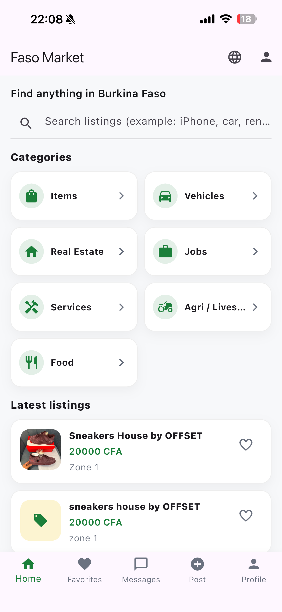
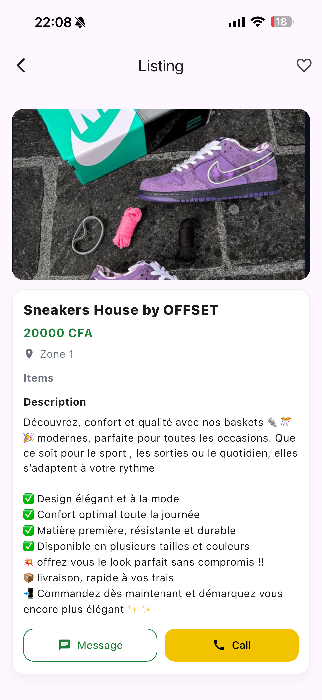
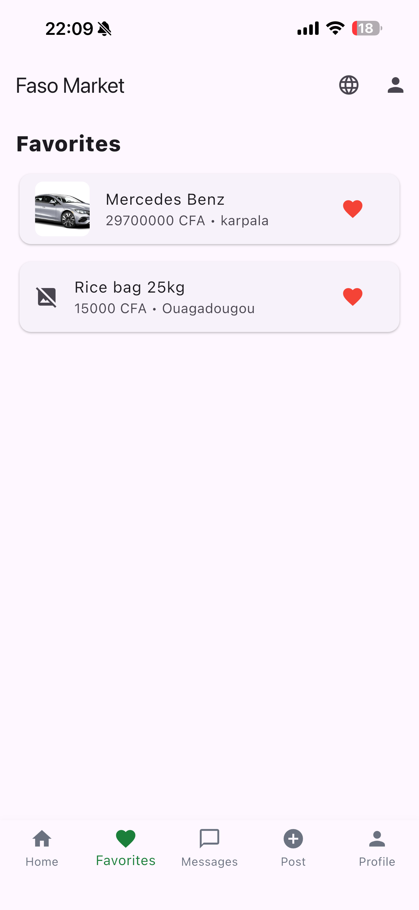
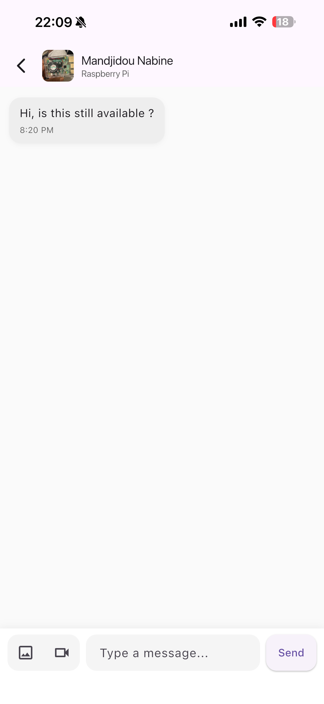
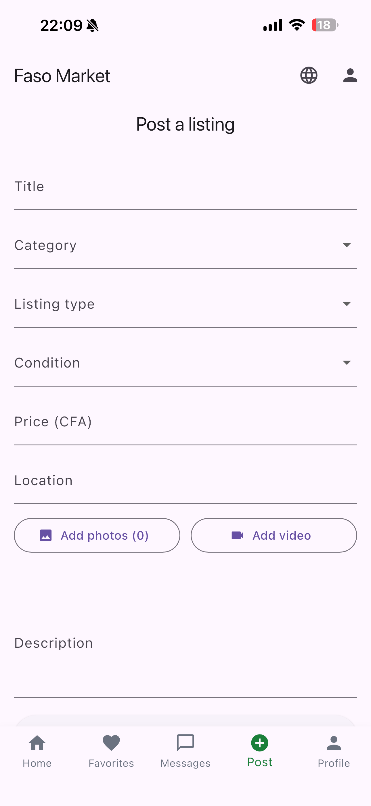
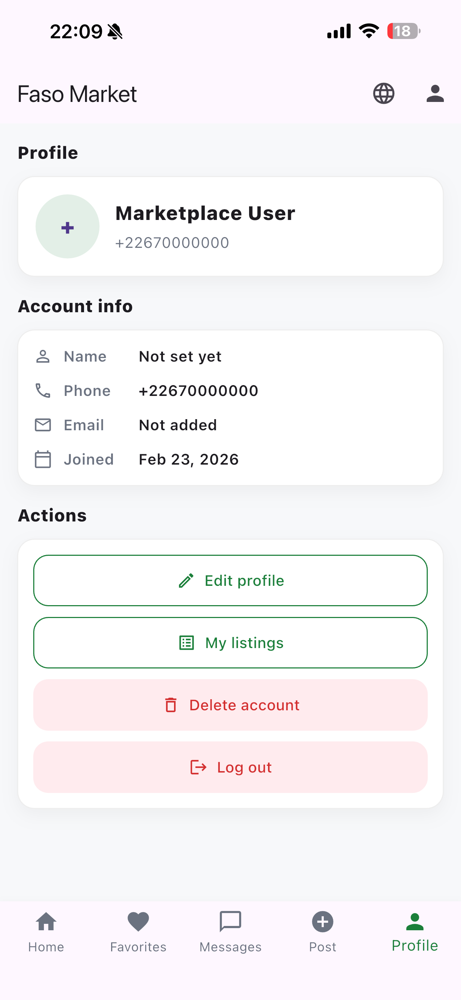

# Faso Market

> A mobile marketplace app for Burkina Faso built with Flutter and Firebase.

Faso Market is a mobile marketplace application designed to help users in Burkina Faso buy and sell items locally.

## Overview

This app allows users to post listings, browse items, chat with sellers, and manage their marketplace activity in a simple mobile interface.

## Features

- User authentication (login/signup)
- Post listings
- Browse categories
- View listing details
- Chat with sellers
- Save favorite items
- Manage listings

## Tech Stack

- Flutter (Frontend)
- Firebase Authentication
- Cloud Firestore
- Firebase Storage

## Screenshots

### Home Screen

### Listing

### Chat

### Favorites

### Post Listing

### Profile

## App Availability

Available on the App Store.

https://apps.apple.com/us/app/faso-market/id6760629499 

## Project Purpose

This project was built to create a real-world marketplace solution for Burkina Faso while demonstrating mobile development and backend integration skills.

## Contact

Email: abdoulrachidsow11@gmail.com
